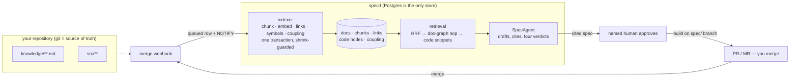

<div align="center">

<picture>
  <source media="(prefers-color-scheme: dark)" srcset="assets/logo-dark.svg">
  
</picture>

# specd

**Spec-driven delivery, productized.**

Connect your repos, an AI provider and a tracker. specd grounds a knowledge base
in your code, drafts every ticket into a **cited** spec, gates it behind a
**named human**, and files the delivered work back into the knowledge base — so
the next spec starts better than the last.

<p>
  <a href="https://github.com/unitypark/specd/actions/workflows/ci.yml"></a>
  <a href="LICENSE"></a>
  
  
  
  
</p>

<p>
  <a href="#quick-start">Quick start</a> ·
  <a href="#how-it-works">How it works</a> ·
  <a href="#the-knowledge-engine">Knowledge engine</a> ·
  <a href="#the-cli">CLI</a> ·
  <a href="#configuration">Configuration</a> ·
  <a href="#project-status">Status</a>
</p>

</div>

> **Status: pre-1.0, local-first.** specd runs end to end as a development
<!-- Keep this a floor, not an exact count — exact counts rot within days.
     Bump when `pnpm test` crosses the next hundred (539 when last raised). -->
> platform on your machine — 500+ TypeScript tests plus a Go suite, CI-gated
> against real Postgres. Nothing deploys it as a service yet, and
> [`knowledge/runbooks/deploy.md`](knowledge/runbooks/deploy.md) says exactly
> what a first deployment would need rather than pretending one exists.

---

## The one rule the whole product enforces

Agents never implement from a bare prompt. They read the project's `knowledge/`
base first, work from a **human-approved** spec, and write what they built back
into the knowledge base in the same PR.

Everything below exists to make that rule true in practice.

```
Connect → Ground → Spec → [HUMAN] → Build → Learn
   01       02       03      04       05      06
                                              └──→ feeds 02
```

The line is fixed. Stations cannot be added, skipped or removed; only station
01 takes configuration; the gate at 04 is structural — no agent may approve its
own input, and the server refuses an unapproved spec no matter who asks.

## What you get

- **Specs a reviewer can check, claim by claim.** Every design claim is either
  cited to a retrieved excerpt or flagged `UNVERIFIED`. Citations are validated
  against what was actually retrieved and judged with **four verdicts**:
  `supported`, `unsupported` (checked and wrong — no such doc, or no such
  section), `unknown` (the corpus couldn't answer — the doc never reached the
  prompt, holds no indexed content, or was cut for budget), and `stale` (the
  passage is real but describes **code that changed since the doc was last
  touched**). "I found no evidence" and "no evidence exists" are different
  answers, and only one of them is safe to write into a spec.
- **A knowledge graph, not just a vector store.** Five deterministic link kinds
  (`citation`, `wikilink`, `symbolref`, `mdlink`, `coderef`) extracted with
  parser rules — **no LLM ever runs at index time**, because a hallucinated
  edge poisons retrieval invisibly. Retrieval is Reciprocal Rank Fusion over
  pgvector + Postgres full-text, then a one-hop expansion across the graph,
  every added chunk carrying the edge that pulled it in.
- **Code-aware.** specd indexes the repository's file tree and its declarations
  (TypeScript, Go, Python — line-based tier, graded against real compilers,
  see [Evals](#evals)). A doc citing `RunnerJobsService.claim()` resolves to
  the real symbol; retrieval serves the function's **actual source** as a
  citable excerpt; and when the code moves on without the doc, both the doc's
  health and the spec's citation say so.
- **Drift measured against the code, not the calendar.** Doc↔code coupling is
  mined from a bounded window of git history — *"6 commits touched
  `apps/api/src/runners/` since this doc last moved with it"* names the code to
  go read, where a 90-day timer only measures time passing.
- **Honest signals, everywhere.** Truncation notices fire only when matching
  material was really cut. Freshness says "unmeasured" rather than "fresh" when
  it cannot know. Health counts broken links, dangling anchors, orphans and
  stale code references as numbers the UI can badge — and they move the score.
- **Operations that survive contact.** Index runs are queued rows woken by
  Postgres `LISTEN/NOTIFY` (no broker — Postgres is the only runtime
  dependency), claimed with `FOR UPDATE SKIP LOCKED`, wrapped in one
  transaction with **shrink guards** that roll back a run trying to delete
  rows nobody authorised. Jobs abandoned by a dead runner are reclaimed by
  lease. Run logs stream live over SSE, across API instances.

## How it works



The loop closes on merge: delivered work re-indexes, the as-built spec lands in
`knowledge/specs/`, and the next spec retrieves it.

## Quick start

### Prerequisites

| You need | Why |
| --- | --- |
| **Node ≥ 22** and **pnpm 10.32.1** | The workspace pins pnpm via `packageManager` — run `corepack enable` once and the right version is used automatically. |
| **Docker** | Postgres with the `vector` extension (`pgvector/pgvector:pg17`, provisioned by `docker-compose.yml`). Postgres is specd's *only* runtime dependency. |
| **Go ≥ 1.25** *(optional)* | Only for building the `specd` CLI. The platform runs without it. |
| **Claude Code CLI or an Anthropic API key** *(optional)* | Only for agent runs. Everything else — indexing, retrieval, the graph, health — works with neither. |

### Just show me

```bash
git clone https://github.com/unitypark/specd.git && cd specd
corepack enable && pnpm install
pnpm demo
```

`pnpm demo` writes a `.env` if there isn't one, starts Postgres and **waits for
it to actually accept connections**, applies migrations, seeds a project with a
fixture repository already connected, and starts both dev servers — printing
the URL and a login. Each step says what it is doing, so a failure names the
step rather than arriving as a stack trace three steps later.

It deliberately leaves the repository **ungrounded**: watching Ground read a
real repository is the most interesting thing specd does, and pre-baking it
would hide the demo's best moment.

The steps below are the same thing done by hand, if you would rather see each
one.

### 1 · Clone and configure

```bash
git clone https://github.com/unitypark/specd.git
cd specd
cp .env.example .env
```

`.env` only needs to **exist** — the dev defaults work as-is, and nothing needs
sourcing into your shell: the API, the migration runner and Next.js each load
the repo-root `.env` themselves. The file ships with a dev database URL, a dev
JWT secret and a dev vault key; every value you'd change for a real environment
is commented with what it does and how to generate it.

### 2 · Install

```bash
corepack enable   # once per machine — activates the pinned pnpm
pnpm install
```

### 3 · Start Postgres

```bash
pnpm infra:up
```

One container: `specd-postgres` (pgvector on Postgres 17), mapped to host port
**5433** so it can never collide with a Postgres you already run on 5432. Data
lives in a named volume and survives restarts — leave it running across
sessions.

### 4 · Create the schema

```bash
pnpm db:migrate
```

Applies plain-SQL migrations in filename order, each in its own transaction,
tracked in `_specd_migrations` — idempotent, so it is also the command to run
after pulling commits that added a migration. The SQL is authored rather than
generated because the schema uses pgvector types, generated `tsvector` columns
and partial indexes a diff tool cannot express.

### 5 · Seed a playground

```bash
pnpm db:seed
```

Writes a small **fixture git repository** to onboard against, so you can walk
the entire pipeline without connecting anything real.

### 6 · Run it

```bash
pnpm dev
```

Two processes in parallel: the **API** on `:4000` (NestJS, restarts itself on
save) and the **web app** on `:3000` (Next.js, fast refresh). Ctrl-C stops
both; Postgres stays up independently.

### 7 · Verify it's actually up

```bash
curl http://localhost:4000/api/health
```

```json
{ "status": "ok", "database": "up", "ai": "no platform key (BYO key per project)",
  "embeddings": "hash", "defaultModel": "claude-opus-5" }
```

`"ai"` saying no key is configured is normal and honest — agent runs will fail
with a clear error until a project supplies one, and nothing else cares.

### 8 · Walk the loop

Open <http://localhost:3000>, create an account, and the wizard takes you
through the stations:

1. **Connect** — register the seeded fixture repo (or your own: a local path,
   a GitHub App installation, or a GitLab token).
2. **Ground** — onboarding reads your repo — manifests, CI workflows, compose
   files, `.env.example`, schemas, workspace layout — and opens a **setup
   PR/branch** with `AGENTS.md` and a `knowledge/` base. Tables of commands,
   pipelines, services, configuration and entities are quoted from the files
   they name; the judgement around them is drafted, and anything the scan
   could not ground says `UNVERIFIED`. The wizard does not pretend to know
   your architecture ([`knowledge/decisions/0015-onboarding-reads-the-repo-before-it-drafts.md`](knowledge/decisions/0015-onboarding-reads-the-repo-before-it-drafts.md)).
3. **Adopt** — merge the setup branch. Merging *is* the adoption signal;
   specd indexes `knowledge/` the moment the webhook lands (local mode has an
   "I merged it" button instead).
4. **Spec** — create a ticket on the board, hit *Draft spec*. The SpecAgent
   retrieves from your knowledge base and drafts requirements (EARS-shaped),
   design claims with citations, and tasks.
5. **The gate** — a named human reviews and approves. This is enforced in the
   state machine *and* a database CHECK constraint: an approved spec without
   an approver cannot exist even via a direct write.
6. **Build** — the build agent implements the tasks, one commit each, on the
   spec's own branch, and opens a PR. It never touches your working tree and
   never pushes to a default branch.
7. **Learn** — you merge, the webhook fires, the as-built spec is filed into
   `knowledge/specs/`, and the index refreshes. The next spec starts better.

Or exercise the whole thing headlessly over the real HTTP API:

```bash
pnpm --filter @specd/api loop
```

Steps that need a model are **skipped and labelled**, never silently passed.

### Giving it a model

Three ways in, and the wizard preflights which of them this machine can do:

**Your Claude subscription — no API key.** specd drives the Claude Code CLI
already signed in on this machine:

```bash
export SPECD_AI_MODE=subscription_runner
```

The constraint is the architecture, not a limitation: specd never sees, stores
or proxies a subscription credential — it shells out to a CLI that is already
logged in, which also means a *hosted* specd cannot offer this mode at all.
Runs consume your subscription quota, so they record tokens but are not metered
in euros. The reply has no schema guarantee, so it is shape-checked with one
repair attempt before giving up.

**An API key** — works from anywhere, schema-enforced, metered per token from a
rate card in integer EUR cents (floats never touch money):

```bash
export ANTHROPIC_API_KEY=sk-ant-...
```

**Neither** — specd still runs end to end. Onboarding writes the whole scanned
half of the knowledge base without a model — commands, CI, services,
configuration, entities, test layout — and leaves each judgement section
carrying the question it exists to answer. Spec generation fails with a clear
error rather than inventing content.

## Runbook

Day-two development — evals, migrations, working on the index, the traps —
lives in [`knowledge/runbooks/local-dev.md`](knowledge/runbooks/local-dev.md).
The essentials:

### Verify before a PR

```bash
pnpm typecheck && pnpm test
```

That is the whole gate — CI runs exactly the same two commands against a real
pgvector service, then **fails the run if the Postgres-dependent suites skipped
themselves** instead of passing (they self-skip when no database is reachable,
which keeps a laptop without Docker green — and would otherwise make a broken
CI database look like a pass).

### Troubleshooting

| Symptom | Cause | Fix |
| --- | --- | --- |
| `DATABASE_URL is required — copy .env.example to .env` | No `.env` at the repo root yet | `cp .env.example .env`, then retry. |
| Same error, `.env` exists | Not at the repo root, or the value is empty | `grep DATABASE_URL .env` from the repo root should print a real value — the loader looks there, not at the shell's `cwd`. |
| API can't reach Postgres | `pnpm infra:up` never ran, or Docker is down | `docker ps` should list `specd-postgres` as `healthy`. |
| `EADDRINUSE` on `:3000`/`:4000` | A previous `pnpm dev` is still running | `lsof -nP -iTCP:3000 -sTCP:LISTEN`, stop it, retry. |
| Schema-shaped error right after pulling | New migrations landed | `pnpm db:migrate` — idempotent. |
| Web dev server 500s after `pnpm build` | `next build` and `next dev` share `apps/web/.next` in incompatible shapes | Stop the dev server, `rm -rf apps/web/.next`, start it again. |
| Whole test file reports *skipped* | No database — or the suite's own `beforeAll` threw | Bring Postgres up; if it persists, suspect the suite's setup, not the database. |

### Resetting

`pnpm infra:down` is a plain `docker compose down` — the data volume survives.
For a true reset: `docker compose down -v`, then
`pnpm infra:up && pnpm db:migrate && pnpm db:seed`.

## The knowledge engine

The part of specd that makes the specs worth trusting. Design notes live in
[`knowledge/architecture.md`](knowledge/architecture.md) and the ADRs under
[`knowledge/decisions/`](knowledge/README.md#decisions); the shape:

**Indexing is deterministic and atomic.** Docs are chunked on headings,
embedded, and their links extracted with parser rules — no model call ever runs
in the indexer. Every write of an index run lands in one transaction guarded
two ways: a refusal to commit a run that would gut the index (an empty listing
against a non-empty index is refused at any size), and a provenance check that
rolls back any run dropping edges from docs it never touched. A per-doc content
sha *plus* an extractor fingerprint decide what to re-index — change the
chunker or the embedder and unchanged docs re-embed, because two vector spaces
in one index is incoherence, not staleness.

**Retrieval is three bounded stages.** RRF over pgvector + tsvector (headings
outrank body text; one doc cannot take every slot), then a one-hop expansion
across resolved links (edge-kind weighted, hub-gated, query-ranked, budget 4),
then up to two **code snippets** — the actual source of symbols the seed docs
reference, read from the repository at retrieval time, fenced in the prompt,
and citable as `path#Class.method`.

**Nothing pretends.** The default embedder is a deterministic local hash — no
second API key, works offline, and the README-level truth is that it is
lexical: the full-text arm carries relevance until you point the index at a
real model. Two ways to do that, and misconfiguring either fails loudly rather
than degrading silently:

```bash
SPECD_EMBEDDING_PROVIDER=voyage   VOYAGE_API_KEY=...          # hosted
SPECD_EMBEDDING_PROVIDER=openai   SPECD_EMBEDDING_BASE_URL=http://localhost:11434/v1
```

The second is any OpenAI-compatible `/v1/embeddings` endpoint — Ollama, LM
Studio, llama.cpp, vLLM — so the ceiling comes off **without a cloud key and
without a repository's knowledge leaving the machine**. The model must produce
1024-dimension vectors to fit the pgvector column; the API probes the endpoint
at startup and refuses a mismatch by name, rather than failing on an insert
halfway through the first index run.

Truncation is announced only when real matches were cut. A doc with no commit
date reports freshness *unmeasured*, not fresh.

## Evals

Quality is graded, not asserted — `pnpm eval`, results committed under
[`evals/results/`](evals/README.md). Extraction is scored against **independent
oracles** that share no assumptions with the code they grade:

| What | Oracle | Corpus | Score |
| --- | --- | --- | --- |
| Symbol extraction (TS) | the TypeScript compiler | this repo, 1,102 declarations | 98.7% precision · 100% recall |
| Symbol extraction (Go) | `go/parser` | **Go stdlib**, 7,654 files / 316k declarations | **99.5% F1** |
| Symbol extraction (Python) | the `ast` module | **Python stdlib**, 3,830 files / 94k declarations | **99.4% F1** |
| Retrieval | 15 labelled questions | this repo's knowledge base | 100% recall · 0.861 MRR |

The stdlib numbers are the ones worth quoting — large corpora nobody tuned
against. The eval harness reports a missing toolchain as *skipped, naming
which*, and a zero-file corpus as *"none here"* rather than a meaningless 100%.
Fifteen labelled questions is a regression guard, not a benchmark, and
[`evals/README.md`](evals/README.md) says so in those words.

## The CLI

```bash
pnpm cli:build      # → ./bin/specd
pnpm cli:install    # → $(go env GOPATH)/bin/specd — warns if that's not on PATH
```

```bash
specd login                    # device flow — a human confirms in the browser
specd use <project>            # default project for this machine
specd spec pull CRM-131        # print an approved spec as markdown
specd spec status CRM-131      # lifecycle state; exit 3 when unapproved
specd specs list --status approved
specd connect .                # register a local repo (code stays on your machine)
specd runner pair XXXXX-XXXXX  # pair this machine as a self-hosted runner
specd open CRM-131             # open the spec in the web app
```

Run `specd` with no arguments at a TTY and you get an interactive shell — the
same capabilities as slash commands, arguments prompted rather than remembered
(`/help` lists them). Scripts and CI keep the plain behaviour. See
[`docs/cli-repl.md`](docs/cli-repl.md).

The CLI fetches, registers and reports. It never authors, reviews or approves —
the server refuses those for CLI tokens regardless of what the binary asks.

**Exit codes:** `0` fine · `1` error · `2` usage · `3` **exists but not
approved** — deliberately distinct, so a pipeline can gate on approval:

```yaml
- name: Require an approved spec
  run: |
    specd spec status "$SPEC_ID"
    case $? in
      0) echo "approved — building" ;;
      3) echo "::error::$SPEC_ID is not approved yet"; exit 1 ;;
      *) echo "::error::could not reach specd"; exit 1 ;;
    esac
```

| Variable | Purpose |
| --- | --- |
| `SPECD_API` | API base URL (default `http://localhost:4000/api`) |
| `SPECD_PROJECT` | default project slug, overriding `specd use` |
| `SPECD_TOKEN` | token override — for CI |
| `SPECD_WEB` | web origin, used by `specd open` |
| `SPECD_RUNNER_TOKEN` | runner token override |

### Checking the setup

```bash
specd doctor          # or --json, for CI
```

specd is several services at once — an API, Postgres with an extension, a vault
key, a web app on another origin, an optional model provider, an optional
embedder, an optional paired runner — and when it does not work the failure
usually surfaces as whatever broke first rather than as the cause.

`doctor` reports config, server, database, embeddings, AI credential, identity
and default project in dependency order, and **skips what an earlier failure
makes unknowable** rather than piling on: one broken thing reads as one broken
thing. Optional configuration is reported as a note, never a fault — no
platform key, no default project and the built-in embedder are all supported
ways to run specd. The embedder note names the retrieval ceiling honestly and
says how to lift it. Exit 4 means something needs fixing.

### Serving the knowledge base to an editor

`specd mcp serve` puts the retrieval engine behind MCP, so an agent working in
Claude Code, Cursor, Windsurf or anything else that speaks the protocol can ask
the knowledge base instead of grepping the repository.

```json
{
  "mcpServers": {
    "specd": { "command": "specd", "args": ["mcp", "serve"] }
  }
}
```

Seven tools — `search_knowledge`, `get_doc`, `verify_citation`,
`knowledge_health`, `spec_status`, `spec_pull`, `list_specs` — and three
resources for ambient state: `specd://knowledge/health`,
`specd://specs/awaiting-review`, `specd://project/summary`.

Search results carry the exact `CITE-AS` string a design claim should use, plus
how each passage was found: a direct match, a graph expansion (with the edge
that pulled it in), or source code a doc references. `verify_citation` returns
the same four verdicts the SpecAgent uses — `supported`, `stale`, `unsupported`,
`unknown` — from the same function, because a citation that is supported in a
spec and unsupported when anyone checks it makes the verdict worthless.

It is **read-only, by construction rather than by convention**: the server
carries the same CLI-audience token as every other command, and the API refuses
those tokens on every route that is not explicitly CLI-allowed. Approving a spec
through it is not blocked — it is impossible. See
[ADR 0017](knowledge/decisions/0017-the-engine-answers-over-mcp.md).

## The Claude Code plugin

`AGENTS.md` is a numbered list of rules, and three of them are enforced by
software: the
server refuses to serve an unapproved spec, the webhook matches merged
`spec/<id>-<slug>` branches back to their spec, and the build station files the
as-built record itself. The rest were enforced by asking nicely.

The plugin in [`plugins/`](plugins/) makes two more of them bind at the moment
they are broken. Install it from this repository, which is its own marketplace:

```
/plugin marketplace add unitypark/specd
/plugin install specd@specd
```

| | |
| --- | --- |
| `/specd:pull <id>` | gate first, then the knowledge the design cites, then the branch |
| `/specd:implement` | tasks in order, one commit each, verify between them |
| `/specd:as-built` | files the record — copied from the approved spec, never composed |

Two hooks do the enforcing. **`gate.sh`** blocks an edit on a `spec/` branch
whose spec is not approved, and it fails *open* on every infrastructure problem
— no CLI, not logged in, server unreachable — because a hook that blocks all
editing when the API is down is a hook people uninstall. **`docs-ride-the-change.sh`**
asks once, when a spec branch changed code and nothing under `knowledge/`,
whether rule 3 was met. Neither can approve anything: that is a signed-in human
in the app, and [ADR 0018](knowledge/decisions/0018-working-agreements-ship-as-a-plugin.md)
says why a plugin that could open the gate would defeat the product.

## Self-hosted runners

Pair a machine (`specd runner pair <code>` — code from the project's Settings),
then start the daemon:

```bash
SPECD_RUNNER_TOKEN=$(specd runner token) SPECD_API=http://localhost:4000/api \
  pnpm --filter @specd/runner start
```

It claims `spec`, `onboard` and `build` jobs, drives the machine's own local
Claude Code, and reports back. It never touches the database or the knowledge
index — the server does that on either side. A job whose runner stops
heartbeating becomes claimable again after its lease (180s; builds 900s), and
after three reclaims it is failed as repeatedly abandoned rather than bouncing
forever.

**A dispatched build clones and pushes with the runner machine's own git
credentials** — specd sends no VCS token, and push access is checked before the
first model call rather than discovered at the end. Details:
[`docs/runners.md`](docs/runners.md).

## The Build station

An approved spec can be built from the spec drawer (or
`POST /projects/:slug/board/specs/:specId/build`). Three properties are
enforced rather than hoped for:

- **The gate is re-checked at the point of use** — an unapproved spec gets the
  same 409 the CLI gets, at the moment agent output would first reach code.
- **The agent gets editing tools only — never a shell.** specd runs the repo's
  own verify command itself.
- **It never touches your working tree.** Local builds use a throwaway git
  worktree; hosted builds a shallow clone in a scratch directory. The branch
  survives; the workspace does not.

The as-built spec is written by specd, not the model — a verbatim record of
what was approved. Verify results distinguish **failed** (your tests ran and
did not pass) from **could not run** (toolchain missing) — different problems,
different reviewers.

## Integrations

**GitHub — as an App, not a PAT.** Repository-scoped tokens that expire within
the hour, three permissions (`contents:write`, `pull_requests:write`,
`metadata:read`), registered in one click with the API running:
`open http://localhost:4000/api/github/app/register`. Webhook deliveries are
HMAC-verified over raw bytes in constant time before parsing; an **unset secret
rejects everything** rather than waving it through; every delivery is recorded
with what specd decided — including the ones it ignored. Walkthrough:
[`docs/github-app.md`](docs/github-app.md).

**Merging is adopting.** The merge *is* the signal — setup branch merged →
adoption recorded and `knowledge/` indexed; `spec/…` branch merged → spec
marked delivered and re-indexed; anything touching `knowledge/` on the default
branch → re-indexed. Closing a PR without merging changes nothing, on purpose.

**GitLab** — gitlab.com and self-managed, connected with an access token
(GitLab has nothing App-shaped). Same adapter interface, same branch-and-MR
write path, same fail-closed webhook rule using the mechanism GitLab actually
offers (token echo, constant-time compare). Walkthrough:
[`docs/gitlab.md`](docs/gitlab.md).

**Jira** — connect, import issues, backlink comments and status mirroring work
from the wizard; sync is **one-way** (see [status](#project-status)).
Walkthrough: [`docs/jira.md`](docs/jira.md).

## The invariants, and where they are enforced

Each is enforced in code, not by convention, and each has a test.

- **Only a named human can approve.** The state machine refuses `approved`
  without an actor, and a database CHECK constraint rejects an approved row
  with no approver — a direct write cannot record an unattributed approval.
- **The gate cannot be routed around.** `specd spec pull` is refused
  server-side for anything unapproved; CLI tokens are audience-scoped and
  rejected on every route that authors or approves.
- **Approval is append-only.** `approved → draft` is refused; v2 supersedes v1
  while v1 keeps its stamp exactly as recorded.
- **A citation means someone can check it.** Validated against what was
  actually retrieved; invented paths are demoted to `UNVERIFIED`, because a
  citation that cannot be followed is worse than none.
- **The loop closes.** The last task of every spec files the as-built copy; if
  the model omits it, it is appended.
- **Spend cannot run away.** Caps are checked before a run starts. Money is
  integer EUR cents.
- **Agents never push.** Editing tools only, the spec's own branch only,
  never a default branch.
- **Webhooks cannot be impersonated.** GitHub: HMAC over raw bytes, constant
  time, before parsing. GitLab: token echo, constant time. Both fail **closed**
  on an unset secret, dedupe by delivery id, and act only for a registered
  repository.
- **Leaving is free.** Git holds the knowledge; the platform holds a derived
  index. Delete a project and nothing you would miss is gone.

## Repository map

| Path | What it is |
| --- | --- |
| `apps/api` | NestJS API — auth, projects, pipeline, agents, the knowledge engine |
| `apps/web` | Next.js — landing, wizard, dashboard, board, spec review, knowledge, runs |
| `apps/runner` | The self-hosted daemon that claims and executes jobs |
| `cli` | `specd` — Go, single static binary |
| `packages/shared` | Spec lifecycle, EARS rendering, model rate card, cost metering |
| `packages/db` | Drizzle schema + plain-SQL migrations (Postgres + pgvector) |
| `packages/templates` | `AGENTS.md`, `CLAUDE.md` and the `knowledge/` scaffold |
| `evals` | Quality grading against independent oracles — see [Evals](#evals) |
| `knowledge/` | specd's own knowledge base — the product eats its own food |

**Stack:** Next.js · NestJS · Postgres + pgvector · Anthropic SDK · Go CLI.
Boring on purpose — Postgres is the only runtime service, and
[`knowledge/decisions/0008-remove-unused-queue.md`](knowledge/decisions/0008-remove-unused-queue.md)
is the decision that keeps it that way.

specd develops specd: this repository's own `knowledge/` is a live instance of
the product's knowledge base — ADRs, runbooks, as-built specs, and the research
that shaped the engine. Start at
[`knowledge/README.md`](knowledge/README.md).

## Project status

Honest, because the wizard must not lie and neither should the README:

- **Working today, local-first:** the full Connect → Learn loop, the knowledge
  engine described above, GitHub App and GitLab integrations, the CLI, the
  runner with lease-based reclaim, CI.
- **Not built yet:** a deployment story
  ([`knowledge/runbooks/deploy.md`](knowledge/runbooks/deploy.md) is the
  honest inventory); Jira **inbound** sync (moving an issue in Jira does not
  move the spec, and the adapter has not run against a live Atlassian site);
  gitlab.com OAuth (token paste only); Stripe billing (spend is metered and
  capped, not billed); runner concurrency (one job at a time per runner).
- **A known ceiling, stated:** the default embedder is lexical, so both
  retrieval arms measure similar signals until you configure a real embedding
  provider. Everything around it is tuned; the ceiling needs a key or a model.

## Development

```bash
pnpm typecheck && pnpm test     # the gate — CI runs exactly this
pnpm eval                       # quality scores (needs DATABASE_URL)
pnpm --filter @specd/api loop   # headless end-to-end over real HTTP
```

Tests that need Postgres run against the real thing and skip themselves when
none is reachable; CI fails if they skipped. Webhook signatures are tested with
real HMAC, App JWTs with real RSA keys, the runner's git layer against the real
`git` binary, and migrations from zero against a throwaway database — the path
a deployment takes and the one that never happens locally.

Working agreements for agents (and the humans reviewing them) are in
[`AGENTS.md`](AGENTS.md); contribution flow in
[`CONTRIBUTING.md`](CONTRIBUTING.md); vulnerability reporting in
[`SECURITY.md`](SECURITY.md).

## Acknowledgments

The knowledge engine's design was sharpened against two open-source projects,
each analysed in depth before a line was written —
[Graphify-Labs/graphify](https://github.com/Graphify-Labs/graphify) and
[vitali87/code-graph-rag](https://github.com/vitali87/code-graph-rag). What was
adopted, and what was deliberately not, is recorded as point-in-time research
in [`knowledge/research/`](knowledge/README.md#research). The original design
document is [`SPEC-PLATFORM-PLAN.html`](SPEC-PLATFORM-PLAN.html).

## License

[MIT](LICENSE) © 2026 Junghwa Theodore Park
